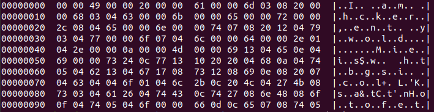
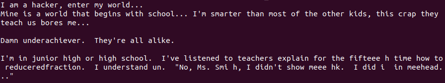
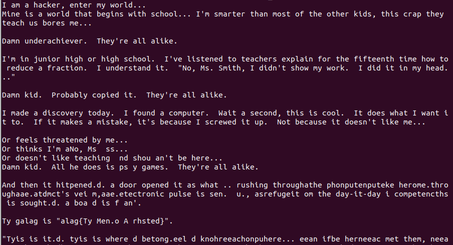

# Hacker Manifesto

## Introduction
We are given a file, which contains ASCII characters as well as other non human readable bytes.
No other meaningful information is given.
If you like puzzles I really recommend trying this challenge yourself, and if you are stuck at some part - just read the next step from this writeup.
It was designed to lead the reader through the thought process of solving this challenge.

## The solution
First thing I did was running
```bash
hd hacker_manifesto.txt | head
```
on this file in order to view raw bytes and characters clearly.



First thing I noticed, was that every 3rd letter contained a valid ascii character.
However, it was apparent, that there were some characters missing from the message, we now had to find how they were encoded!

### Step one: find original, try to decode something
With a little help from a friend of mine we were able to find original text : [The Conscience of a Hacker](http://phrack.org/issues/7/3.html)

After comparing the given file with the original text we started noticing more differences.
By manually comparing the two texts, we quickly started analysis on what was exactly going on:
```
0x01:   00 00 49     I
0x02:   00 00 20    ' '
0x03:   00 00 61     a
0x04:   00 00 6d     m      # Missing: ' 'a
0x05:   03 08 20    ' '
0x06:   00 00 68     h      # Missing: a
0x07:   03 04 63     c
0x08:   00 00 6b     k
0x09:   00 00 65     e
0x0A:   00 00 72     r
0x0B:   00 00 2c     ,      # Missing: ' '
0x0C:   08 04 65     e
0x0D:   00 00 6e     n
0x0E:   00 00 74     t      # Missing: er
0x0F:   07 08 20    ' '     # Missing: m
0x10:   12 04 79     y
```
We quickly noticed, that the first byte in a sequence of three seems to point to how much back we have to go for a correct character in this place.
For example, on line 0x07, we were expecting letter `a`, but instead we found `c`
When comparing this to the original file, you can notice, that 3 characters before that position was letter `a`.
```
I   <-- idx 0
    <-- idx 1
a   <-- idx 2
m   <-- idx 3
    <-- idx 4
a   <-- idx 5
    <-- idx 6
h   <-- idx 7
a   <-- idx 8
c
k
```
The same goes for the first missing characters on line 0x05, but there, instead of 1 character missing, there were two.

### Step two: state a thesis, support it
Now, I was stuck in this place for a while, until again my friend suggested, that the second byte of each sequence of three, after divided by 4 might mean the number of characters from a given place, pointed by first byte.

I quickly verified if thats a plausible explanation by verifying, if there was ever a situation in any sequence of three bytes, that either first or second byte is 0x00, even though the other one is not.

```bash
cat hacker_manifesto.txt | xxd -p | tr -d \\n | sed 's/\(..\)\(..\)\(..\)/\1 \2 \3\n/g' | grep '\( \|^\)00 '
#   ^ print file           ^ change it to hex stream   ^find 3 groups of 2 characters each
#                                   ^ removing '\n' from the stream       # print Byte1<space>Byte2<space>Byte3<enter>
# The result:                                   ^ using sed - stream editor               ^ find all lines, that start with '00 ' or contain ' 00 '
00 00 49
00 00 20
00 00 61
00 00 6d
00 00 68
00 00 6b
00 00 65
00 00 72
00 00 2c
00 00 6e
00 00 74
00 00 6f
00 00 64
00 00 2e
00 00 0a
00 00 4d
00 00 69
00 00 73
00 00 66
00 00 70
00 00 76
00 00 54
00 00 4e
```
By running this command, I quickly confirmed there were no 0x00 bytes coupled with non 0x00 byte on 1st or 2nd position.

I also noticed, that some of the second bytes were not divisible by 4, but I left that for later, I first wanted to see if that might have a chance of working for smaler part of the file.

### Step three: support it!!!
I'm not really familiar in how to efficiently manipilate low-level structures in python, so I've decided to use C++ for this one.
To have a complete control over the input, I used sscanf, reading 3 bytes into 3 variables each reading loop.
```c++
#include <iostream>
#include <stdio.h>
#include <vector>

int main(){
  unsigned char a,b,c;
  unsigned int temp, index;
  bool trace = false;

  std::vector<char> res;
  while (scanf("%c%c%c", &a, &b, &c) != -1){  // main reading loop
    index = res.size();
    if (a != 0){                              // if first byte is not a 0x00, we have to take some letter from earlier part of the input
      temp = res.size() - a;                  // find the index where the substring starts
      for(int i = 0; i < b/4; ++i)            
        res.push_back(res[temp + i]);         // add one letter.. one by one.. yeah, there is probably something better for that, but hey, speed is not of the essence here!
    }
    res.push_back(c);
    for(int i = index; i < res.size(); ++i)
      std::cout << res[i];                    // print characters added in this loop ONLY
  }
  return 0;
}
```

The program went really well until here:
```
I've listened to teachers explain for the fifteenth
                                                ^
```
I was expecting `fifteenth`, and instead I got.. this:


After debugging for a little while, I have noticed, that this is the first place, where second byte is not divisible by 4.
When looking for what was missing (`nt`) between already printed `fiftee` and third byte `h`, I noticed, that it already occured as 0x17th and 0x18th byte.
However, current number of characters in `res` vector was nearing 280, a number beyond what one byte could fit (0xff == 255).

Then maybe lower 2 bits of second byte meant multiple of 256, when looking back for specific byte in the sequence?

### Step four: improve upon it!

I quickly added very dirty (but working) improvement, eager to test this new idea.
```c++
#include <iostream>
#include <stdio.h>
#include <vector>

int main(){
  unsigned char a,b,c;
  unsigned int temp, index;
  bool trace = false;
  unsigned int lookback;

  std::vector<char> res;
  while (scanf("%c%c%c", &a, &b, &c) != -1){
    index = res.size();
    if (a != 0){
      lookback = a + (b % 4 != 0 ? 256 : 0);  // if second byte is not divisible by 4, add 256
      temp = res.size() - lookback;
      for(int i = 0; i < b/4; ++i)            
        res.push_back(res[temp + i]);
    }
    res.push_back(c);
    for(int i = index; i < res.size(); ++i)
      std::cout << res[i];
  }
  return 0;
}
```
After compiling and running
```bash
g++ solution.c && cat hacker_manifesto.txt | ./a.out
```
I got following result:


First, I noticed that close to the bottom, there was something, that reassembled a flag format rather closely.
Besides that, about 10 lines higher I saw, that there was still some problem with the algorythm..
If you look closely, you might notice, that a string `No, Ms` occured before.

I'm ashamed to admit that, but it took me way longer that it should, especially after finding the relation between second byte and 256..
Remember, if you are stuck at something like that, don't go straight for a flag, that is not the way :D

### Step five: FLAG!
If you are a careful reader, you already know, why this didn't work..
Let's just say, that after adding `256 * (b % 4)` instead of flat 256, the program worked... better :)
Finally, flag was withing my reach, it was....
`flag{TheMentorArrested}`
